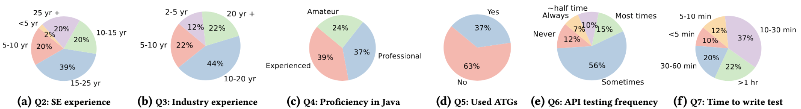

# SAINT: Service-level Integration Test Generation with Program Analysis and LLM-based Agents
Enterprise applications are typically tested at multiple levels, with service-level testing playing an important role in validating application functionality. Existing service-level testing tools, especially for RESTful APIs, often employ fuzzing and/or depend on OpenAPI specifications which are not readily available in real-world enterprise codebases. Moreover, they fail to generate functional tests that exercise meaningful scenarios. In this work, we present SAINT, a novel white-box testing approach for service-level testing of enterprise Java applications. SAINT combines static analysis, large language models (LLMs), and LLM-based agents to automatically generate endpoint and scenario-based tests. The approach builds two key models: an endpoint model, capturing syntactic and semantic information about service endpoints, and an operation dependency graph, capturing inter-endpoint ordering constraints. SAINT then employs LLM-based agents to generate tests. Endpoint-focused tests aim to maximize code and database interaction coverage. Scenario-based tests are synthesized by extracting application use cases from code and refining them into executable tests via planning, action, and reflection phases of the agentic loop. We evaluated SAINT on eight Java applications, including a proprietary enterprise application. Our results illustrate the effectiveness of SAINT in coverage, fault detection, and scenario generation. Moreover, a developer survey provides strong endorsement of the scenario-based tests generated by SAINT. Overall, our work shows that combining static analysis with agentic LLM workflows enables more effective, functional, and developer-aligned service-level test generation.

### Prompts

  

In this figure, we show various prompts that we used and the input details and the output format. For each prompt, we provide those details with 1-2 examples to guide LLMs to follow the output format.
### Developer Background

  

These figures are related to the survey that we conducted and the background of the participants
### RQ1 Results

### RQ
RQ Results are uploaded with coverage details and generated tests. RQ2 has been put under RQ2.zip.
